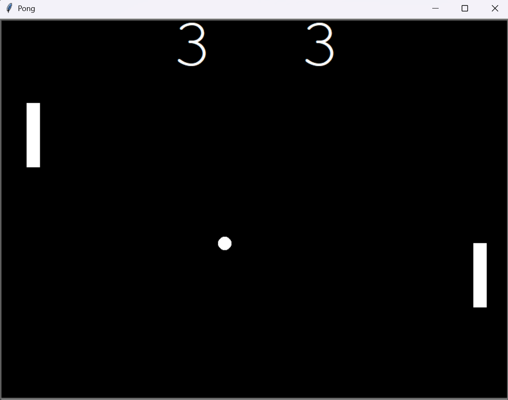

# 📅 Day 22 - Python Learning Log

## 🧠 Topics Covered
- **Pong Game Project (Classic Arcade Game)**:
  - Built using **Python Turtle** and **OOP concepts**.
  - Created separate classes for Paddle, Ball, and ScoreBoard.
  - Implemented collision detection with walls and paddles.
  - Controlled ball speed dynamically using `time.sleep()`.
  - Added score tracking for both left and right players.

## 📂 Files Included

- `pong_game.py`:  
  - Main game file.  
  - Sets up the screen, paddles, ball, and scoreboard.  
  - Handles the main game loop with collision detection and scoring.

- `paddle.py`:  
  - Defines the `Paddle` class:
    - Inherits from `Turtle`.  
    - Can move up and down using `go_up` and `go_down` methods.  
    - Left and right paddles are created at fixed positions.

- `ball.py`:  
  - Defines the `Ball` class:
    - Moves continuously across the screen.  
    - Bounces off top and bottom walls using `bounce_y()`.  
    - Reverses direction and speeds up when hitting paddles (`bounce_x()`).  
    - Resets to the center with `reset_position()` when a paddle misses.

- `scoreboard.py`:  
  - Defines the `ScoreBoard` class:
    - Displays current scores for both players.  
    - Updates when a player misses the ball.  
    - Keeps track of **left score** and **right score**.

## 🎮 Controls
- **Right Paddle (Player 1):**  
  - `Up Arrow` → Move Up  
  - `Down Arrow` → Move Down  

- **Left Paddle (Player 2):**  
  - `W` → Move Up  
  - `S` → Move Down  

## 📸Screenshot

## 📝 Summary
On Day 22, I:
- Developed a **two-player Pong game** with Python.  
- Learned to manage multiple classes in a larger project.  
- Implemented **real-time collision detection** and **game controls**.  
- Practiced **event-driven programming** (`onkey`) for paddle movement.  
- Enhanced gameplay by dynamically adjusting ball speed.  

## 🚀 Key Learnings
- Modular programming makes game development easier by splitting into multiple files.  
- `super().__init__()` helps reuse Turtle properties in custom classes.  
- Collision detection can be handled by checking distances (`distance()`) and coordinates.  
- Adjusting `time.sleep()` controls game speed and difficulty.  
- Classic games like Pong are a fun way to practice **OOP + event-driven programming** in Python.  

## 🔗 Resources Used
- [Python Turtle Docs](https://docs.python.org/3/library/turtle.html)  
- [Object-Oriented Programming in Python - RealPython](https://realpython.com/python3-object-oriented-programming/)  
- [100 Days of Code: The Complete Python Pro Bootcamp](https://www.udemy.com/course/100-days-of-code/)  

---

> 🕹️ This was my **second complete arcade-style game** in Python after Snake!  
> 💬 These codes are part of my hands-on learning. If you spot bugs or have suggestions, feel free to contribute or share feedback!  
> 💡 Part of my #100DaysOfPython challenge. Follow along here: [Here](https://github.com/Pushp11721/100DaysOfPython-LearnAlong)  
