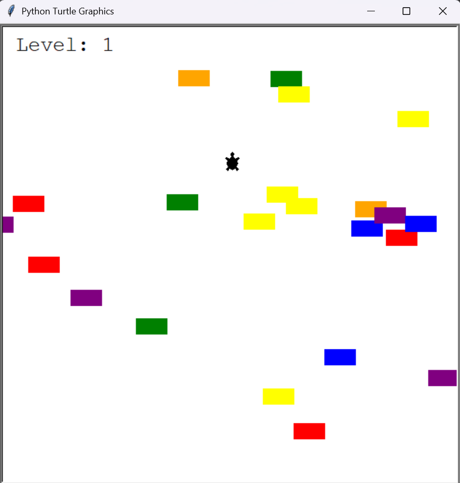

# 📅 Day 23 - Python Learning Log

## 🧠 Topics Covered
- **Turtle Crossing Game (Arcade-style project)**:
  - Used **Object-Oriented Programming** with multiple classes.
  - Managed player movement with keyboard controls.
  - Created moving cars with randomized colors and positions.
  - Implemented collision detection between player and cars.
  - Added level progression with increasing difficulty.
  - Displayed game score (levels) and "GAME OVER" message.

## 📂 Files Included

- `turtle_crossing.py`:  
  - Main game loop.  
  - Sets up the screen, initializes `Player`, `CarManager`, and `Scoreboard`.  
  - Handles collision detection and level progression.  

- `player.py`:  
  - Defines the `Player` class (turtle character).  
  - Moves upward with key press.  
  - Resets position when crossing the finish line.  
  - Checks if the turtle reached the finish line.  

- `car_manager.py`:  
  - Defines the `CarManager` class.  
  - Creates cars at random intervals with random colors.  
  - Moves cars across the screen.  
  - Increases car speed when player levels up.  

- `scoreboard.py`:  
  - Defines the `Scoreboard` class.  
  - Displays the current level.  
  - Updates level when player crosses successfully.  
  - Shows "GAME OVER" when collision occurs.  

## 🎮 Controls
- **Player (Turtle):**  
  - `Up Arrow` → Move forward

## 📸 Screencshot

## 📝 Summary
On Day 23, I:  
- Built the **Turtle Crossing game**, inspired by the classic Frogger arcade style.  
- Practiced managing multiple classes (`Player`, `CarManager`, `Scoreboard`) in one project.  
- Used randomization to generate cars of different colors and positions.  
- Implemented **collision detection** between player and cars.  
- Added **difficulty scaling** by speeding up cars after each level.  

## 🚀 Key Learnings
- Randomization (`random.randint`, `random.choice`) adds unpredictability to games.  
- Separating logic into multiple classes makes the code **cleaner and modular**.  
- Collision detection can be handled with simple `distance()` checks.  
- Difficulty can be increased dynamically using incremental speed.  
- Using `screen.tracer(0)` with `screen.update()` allows smoother animations.  

## 🔗 Resources Used
- [Python Turtle Docs](https://docs.python.org/3/library/turtle.html)  
- [Random Module in Python](https://docs.python.org/3/library/random.html)  
- [100 Days of Code: The Complete Python Pro Bootcamp](https://www.udemy.com/course/100-days-of-code/)  

---

> 🐢 This was my **third full arcade-style game** after Snake 🐍 and Pong 🏓!  
> 💬 These codes are part of my hands-on learning. If you spot bugs or have suggestions, feel free to contribute or share feedback!  
> 💡 Part of my #100DaysOfPython challenge. Follow along here: [Here](https://github.com/Pushp11721/100DaysOfPython-LearnAlong)  
