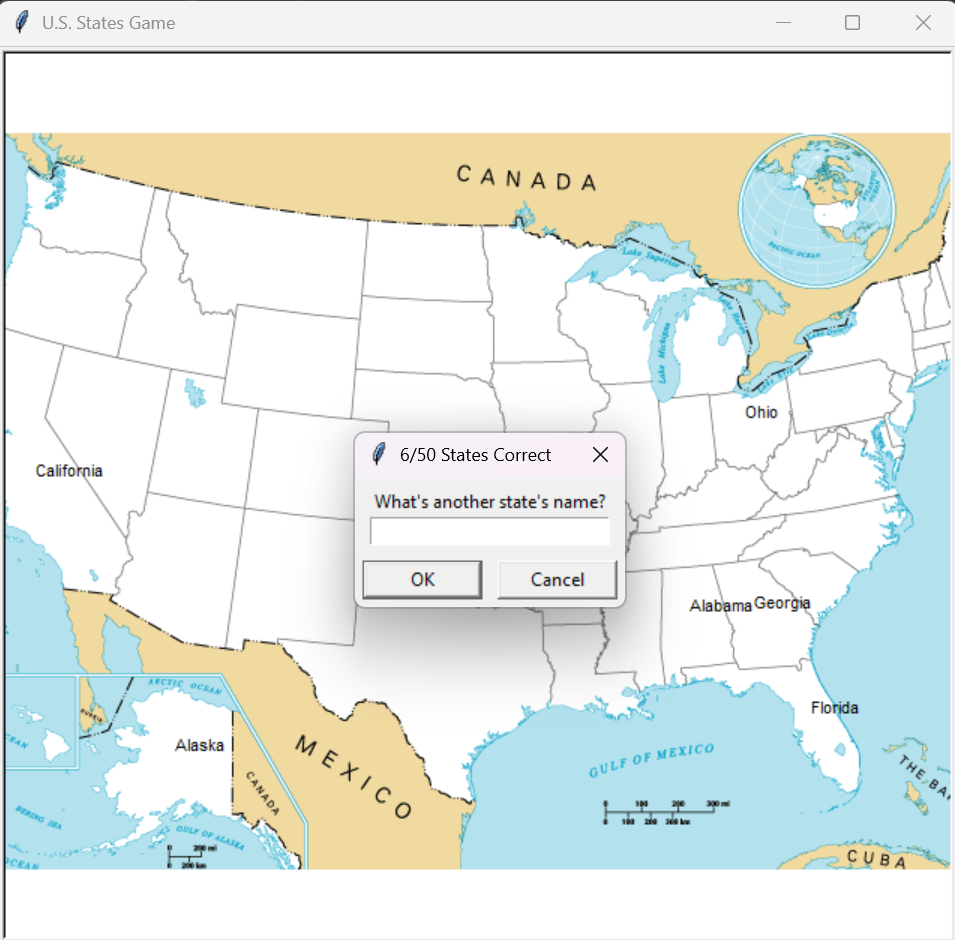

# 🎮 U.S. States Game

An interactive quiz game built with **Python Turtle Graphics** and **Pandas**.  
The goal: Guess all **50 U.S. States** by typing their names. Correct guesses are written directly on the map!

---

## 🧠 Features
- Displays a **blank U.S. map** (`blank_state_img.gif`).
- User inputs state names via popup dialogs.
- Correct guesses are written at the correct coordinates from `50_states.csv`.
- Tracks progress (`score/50`).
- Generates `missed_state.csv` containing unguessed states for revision.
- Simple **data analysis + visualization** project combining:
  - `pandas` for data handling.
  - `turtle` for graphics.

---

## 📂 Files Included
- `main.py`: Core game script.  
- `50_states.csv`: Dataset containing state names with x,y coordinates for map placement.  
- `blank_state_img.gif`: Background map image.  
- `missed_state.csv`: Auto-generated file with states you didn’t guess.  

---

## ▶️ How to Run
1. Make sure you have **Python 3.x** installed.  
2. Install required library (if not already installed):  
   ```bash
   pip install pandas
3. Run the script:  
   ```bash
   python main.py
4. Make sure you have **Python 3.x** installed.
- Enter U.S. state names in the popup.
- Correct guesses appear on the map.
- Type Exit to quit early → `missed_state.csv` will be created with states left unguessed.

---

## 📝 Example Output
- If you guessed California, the state name will appear at its coordinates on the map.
- Exiting the game after 30 guesses → `missed_state.csv` lists the remaining 20 states to learn.

---

## 🖼️ Screenshot


---

## 🚀 Key Learnings
- Using turtle graphics for visualization.
- Handling datasets with pandas.
- Combining data with interactivity to make learning fun.
  
---

## 🔗 Resources Used
- [Pandas Documentation](https://pandas.pydata.org/docs/)  
- [Turtle Graphics - Python Docs](https://docs.python.org/3/library/turtle.html)  
- [100 Days of Code: The Complete Python Pro Bootcamp](https://www.udemy.com/course/100-days-of-code/)  

---

> 💬 These codes are part of my hands-on learning.  
> If you spot bugs or have suggestions, feel free to contribute or share feedback!  

> 💡 Part of my #100DaysOfPython challenge. Follow along here: [Here](https://github.com/Pushp11721/100DaysOfPython-LearnAlong)
