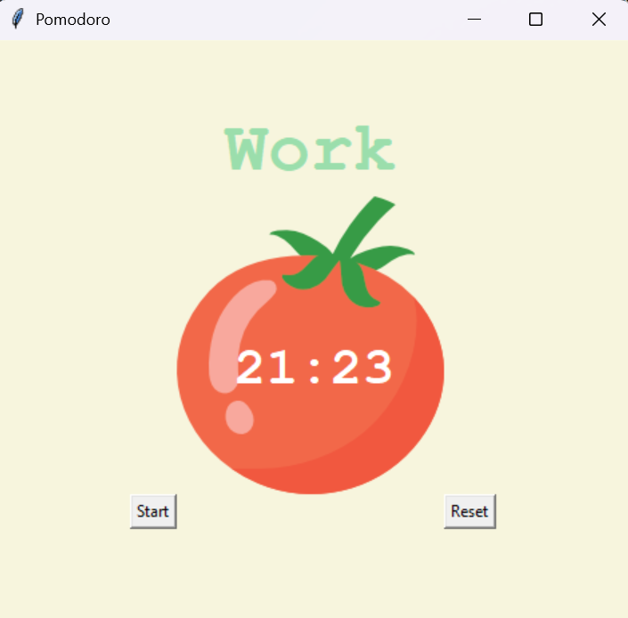

# 📅 Day 28 - Python Learning Log

## 🧠 Topics Covered
- **Pomodoro Technique**:
  - 25 min work → 5 min short break → 20 min long break.
  - Productivity method to improve focus.

- **Tkinter GUI Development**:
  - Creating interactive GUI windows with `Tk()`.
  - Using **Canvas** to display images and dynamic text.
  - Adding **Labels** for titles, timers, and checkmarks.
  - Adding **Buttons** for Start and Reset functionality.

- **Timer & Countdown Logic**:
  - Used `after()` to schedule repeated function calls.
  - Implemented **countdown mechanism** for timer.
  - Handled **reset functionality** to stop/reset timer.
  - Displayed ✔ marks for completed work sessions.

- **Math & Time Formatting**:
  - Used `math.floor()` for converting seconds into minutes.
  - Added zero-padding for seconds `< 10`.

---

## 📂 Files Included

- `main.py`:  
  - Complete Pomodoro Timer app with Start/Reset buttons.  
  - Implements countdown logic, break cycles, and ✔ checkmarks.

- `tomato.png`:  
  - Background image for the Pomodoro Timer.

---

## 🖼 Preview Screenshot
Here’s what the **Pomodoro Timer App** looks like:

---

## 📝 Summary
On Day 28, I:  
- Learned about the **Pomodoro productivity method**.  
- Built a **Tkinter-based GUI app** with images, labels, and buttons.  
- Practiced using **`after()`** for scheduling function calls in Tkinter.  
- Implemented **countdown, reset, and session tracking** logic.  
- Added ✔ marks to track completed work sessions.  

---

## 🚀 Key Learnings
- Tkinter can handle **timed events** with `after()`.  
- **Canvas** is powerful for combining images and dynamic text.  
- Managing **global state variables** (`REPS`, `TIMER`) is important in GUI apps.  
- Productivity techniques like **Pomodoro** can be coded into real apps.  
- Small projects are a great way to integrate **logic + GUI**.  

---

## 🔗 Resources Used
- [Pomodoro Technique - Wikipedia](https://en.wikipedia.org/wiki/Pomodoro_Technique)  
- [Python Tkinter - W3Schools](https://www.w3schools.in/python/gui-programming)  
- [Tkinter Canvas - Python Docs](https://docs.python.org/3/library/tkinter.html)  
- [100 Days of Code: The Complete Python Pro Bootcamp](https://www.udemy.com/course/100-days-of-code/)  

---

> 💬 These codes are part of my hands-on learning.  
> If you spot bugs or have suggestions, feel free to contribute or share feedback!  

> 💡 Part of my #100DaysOfPython challenge. Follow along here: [Here](https://github.com/Pushp11721/100DaysOfPython-LearnAlong)
