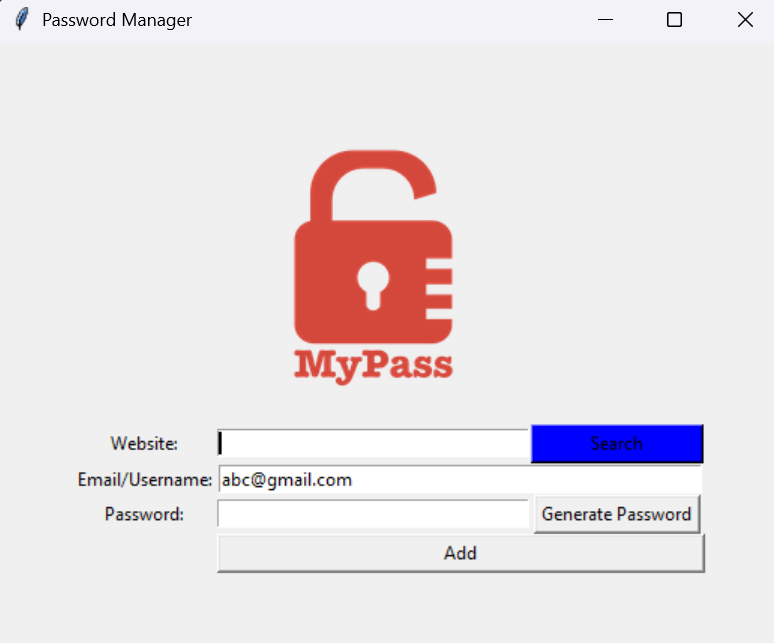

# 📅 Day 29 - Python Learning Log

## 🧠 Topics Covered
- **Password Manager GUI App (Tkinter + JSON + Clipboard)**:
  - Built a full-fledged **Password Manager** application.
  - Integrated **Tkinter** for GUI interface.
  - Implemented **random password generation** using `random` module.
  - Added **clipboard copy** feature using `pyperclip`.
  - Saved and retrieved credentials using **JSON file handling**.
  - Implemented **data persistence** and **error handling**.

- **Key Features**:
  - **Password Generator**:  
    - Randomized combination of letters, numbers, and symbols.  
    - Automatically copied to clipboard for convenience.  
  - **Save Functionality**:  
    - Stores credentials in `data.json` in a structured format.  
    - Updates JSON file dynamically when adding new entries.  
  - **Search Functionality**:  
    - Fetches and displays stored credentials in a messagebox.  
    - Handles missing files or unavailable data gracefully.  
  - **GUI Enhancements**:  
    - Interactive layout with Labels, Buttons, and Entries.  
    - Focus cursor on startup, pre-filled email, and neat spacing.  

---

## 📂 Files Included

- `main.py`:  
  - Main GUI script for the Password Manager.  
  - Includes password generation, saving, searching, and clipboard features.  

- `data.json`:  
  - Stores website credentials in JSON format.  
  - Example:
    ```json
    {
      "Amazon": {
        "email": "abc@gmail.com",
        "password": ")s(17!0#nKOsIpcrs"
      },
      "Netflix": {
        "email": "Golu",
        "password": "pSe6%VgoTu1rS#"
      }
    }
    ```

- `data.txt`:  
  - Earlier version for saving credentials (now replaced by JSON storage).  

- `logo.png`:  
  - Lock icon used in the app’s GUI Canvas.  

- `sandbox.py`:  
  - A small Tkinter test file demonstrating color blocks layout using grid positioning.

---

## 🖼 Preview Screenshot
Here’s what the **Password Manager App** looks like:



---

## 📝 Summary
On Day 29, I:  
- Built a **Password Manager GUI app** combining Tkinter, JSON, and Python logic.  
- Learned to **generate, store, and retrieve** credentials dynamically.  
- Used `pyperclip` for instant clipboard copy functionality.  
- Implemented **data persistence** with structured JSON storage.  
- Handled **file errors**, empty input validation, and user feedback via messageboxes.  

---

## 🚀 Key Learnings
- `json.load()` and `json.dump()` are powerful for reading/writing structured data.  
- Always wrap file operations with `try/except` to handle missing or corrupt files.  
- `pyperclip.copy()` is great for auto-copying passwords.  
- Tkinter widgets like **Entry**, **Button**, and **Canvas** can be combined for polished apps.  
- A simple GUI project can combine multiple real-world programming skills.  

---

## 🔗 Resources Used
- [JSON in Python - W3Schools](https://www.w3schools.com/python/python_json.asp)  
- [Tkinter GUI Programming - Python Docs](https://docs.python.org/3/library/tkinter.html)  
- [Clipboard Handling with Pyperclip](https://pypi.org/project/pyperclip/)  
- [100 Days of Code: The Complete Python Pro Bootcamp](https://www.udemy.com/course/100-days-of-code/)  

---

> 💬 These codes are written as part of my learning journey. While I’ve done my best (with help from online resources), mistakes or bugs are possible. **Feel free to share corrections, suggestions, or improvements!** 

> 💡 Part of my #100DaysOfPython challenge. Follow along here: [Here](https://github.com/Pushp11721/100DaysOfPython-LearnAlong)
