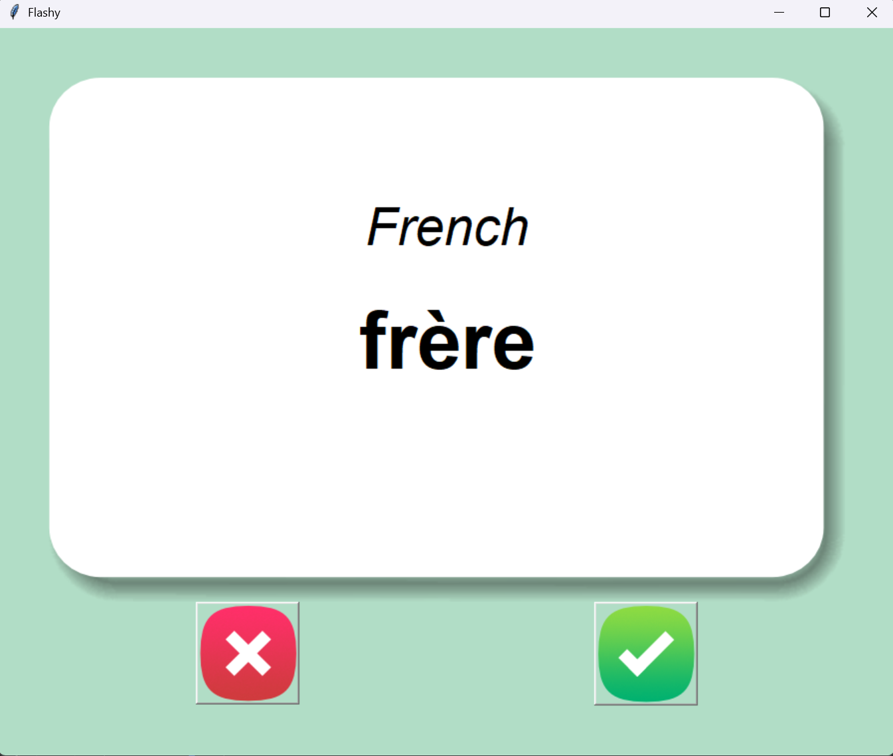
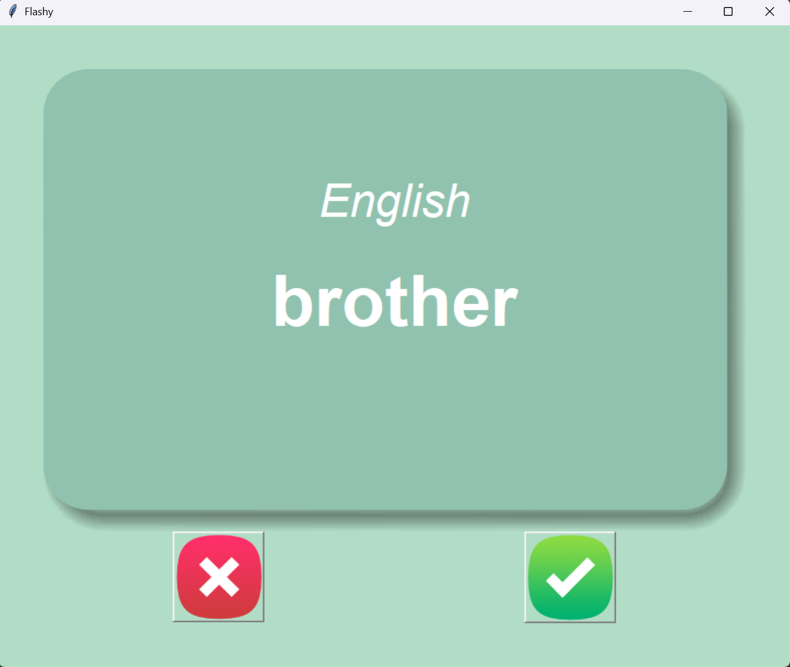

# 📅 Day 31 - Python Learning Log

## 🧠 Topics Covered
- **Flash Card App (Language Learning Game)**:
  - Built an interactive **French-to-English flash card app** using Tkinter and Pandas.
  - Used random selection and timers to simulate real-time flashcard flipping.
  - Implemented persistent data saving with CSV files.

- **Core Features**:
  - **Word Generation**:
    - Randomly selects a new French word from a CSV file.
    - Displays it for a few seconds before flipping to show the English translation.
  - **Auto Flip with Timer**:
    - Uses `window.after()` to automatically flip the card after 3 seconds.
  - **Mark as Known / Unknown**:
    - ✅ “Right” button removes known words from the learning list.
    - ❌ “Wrong” button skips to the next word.
  - **Persistent Learning Progress**:
    - Known words are removed from the list and saved to a new file `words_to_learn.csv`.
    - Ensures users don’t see already mastered words in future sessions.

- **Data Management**:
  - Reads initial data from `french_words.csv`.
  - Creates/updates `words_to_learn.csv` for personalized progress.
  - Converts CSV to dictionary using `pandas.to_dict(orient="records")`.

- **GUI with Tkinter**:
  - Beautiful design using **Canvas** and background images.
  - Includes buttons, labels, and smooth card flipping transitions.
  - Utilizes images like `card_front.png`, `card_back.png`, `right.png`, `wrong.png`.

---

## 📂 Files Included

### 📁 flash-card-project-start/
- `main.py`:  
  - Core app logic including:
    - Random word generation.
    - Auto card flipping.
    - Button event handling for known/unknown words.
    - Persistent CSV data updates.

### 📁 data/
- `french_words.csv`:  
  - Original dataset of **French-English word pairs**.

- `words_to_learn.csv`:  
  - Stores remaining words for future practice.  
  - Automatically generated and updated as user progresses.

### 📁 images/
- `card_front.png`: Front design for French words.  
- `card_back.png`: Back design for English translation.  
- `right.png`: ✅ Image for the “Known” button.  
- `wrong.png`: ❌ Image for the “Unknown” button.

---

## 🖼 Preview Screenshot
Here’s what the **Flash Card App** looks like:

---

## 📝 Summary
On Day 31, I:  
- Built a **Flash Card Learning App** to help memorize French vocabulary.  
- Used **Tkinter Canvas**, **Buttons**, and **PhotoImage** for an interactive GUI.  
- Implemented **timed flipping** using `after()` and `after_cancel()`.  
- Practiced **file handling with Pandas** for saving user progress.  
- Enhanced the user experience with dynamic word updates and clean visuals.

---

## 🚀 Key Learnings
- **Pandas DataFrame → Dictionary conversion** makes it easy to handle structured CSV data.  
- **Tkinter Canvas** supports layered visuals with images and text.  
- **`after()` & `after_cancel()`** are great for scheduling UI updates.  
- Persisting user data (via CSV) adds a **real-world touch** to projects.  
- Combining GUI + logic + data persistence creates powerful learning tools.

---

## 🔗 Resources Used
- [Tkinter Canvas Documentation](https://docs.python.org/3/library/tkinter.html)  
- [Pandas DataFrame to Dictionary](https://pandas.pydata.org/docs/reference/api/pandas.DataFrame.to_dict.html)  
- [100 Days of Code: The Complete Python Pro Bootcamp](https://www.udemy.com/course/100-days-of-code/)  

---

> 💬 These codes are written as part of my learning journey. While I’ve done my best (with help from online resources), mistakes or bugs are possible. **Feel free to share corrections, suggestions, or improvements!** 

> 💡 Part of my #100DaysOfPython challenge. Follow along here: [Here](https://github.com/Pushp11721/100DaysOfPython-LearnAlong)
